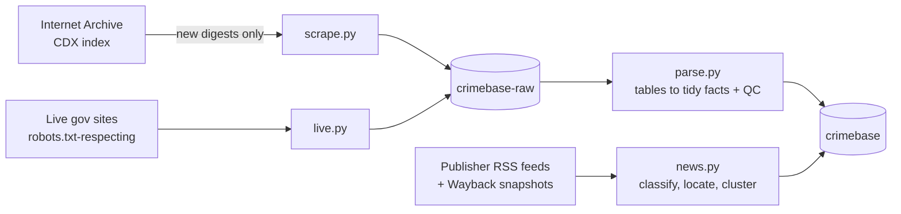

# CrimeBase

**An automated, source-cited archive of crime data for India**: official statistics (including documents NCRB has since taken down) and a growing stream of crime news, cleaned, categorised, quality-checked and published to Kaggle by GitHub Actions. No server, no cost, no manual steps.

| Dataset | What it is |
|---|---|
| **`crimebase`** (clean) | **`crime_state_year.csv`** and **`crime_india_year.csv`**: the clean tables, one row per state (or all-India) x year x crime head x measure, sum-checked against NCRB's own totals and de-duplicated. `documents.csv`: every source document with its URL, Wayback permalink and title. `facts.parquet`: every number from NCRB's Excel tables as one row (about 7M), with ISO state codes, category, metric, year, QC flag and full provenance. `news.parquet` / `news_events.parquet`: crime news classified by category, state, victim group and stage, clustered into distinct events. `PROFILE.md`: what is in the data, refreshed every run. `facts_pdf_lowconf.parquet`: the same facts from archived PDFs (lower confidence). |
| **`crimebase-raw`** | the original, unmodified PDF/XLS/XLSX/DOC/ZIP files in folders `raw-0` .. `raw-f` (content-addressed), with `documents.csv` (catalogue: title, year, URL, Wayback permalink, parse status) and `manifest.csv` (ledger). The same bundles are a GitHub release, [`raw-archive`](https://github.com/chandranshB/CrimeBase/releases/tag/raw-archive). |

Column definitions and caveats: [DATA_DICTIONARY.md](DATA_DICTIONARY.md). Every upstream: [SOURCES.md](SOURCES.md).

## How it works



* **Grows every day, never repeats itself.** `scrape.py` asks the Internet Archive which captures exist and downloads only those whose content digest is new. The same bytes under another URL are linked, not re-downloaded; a document that changed over time keeps each distinct version. Runs are time-boxed and resume where they stopped, so coverage widens run after run.
* **Self-healing store.** If stored files go missing (or the store is rebuilt from `manifest.csv` alone), `scrape.py` re-fetches each one from its recorded Wayback capture or URL and keeps it only if the bytes hash to the recorded SHA-256; sources that no longer serve those bytes are remembered in `lost.json`.
* **Live and archived.** `live.py` also crawls the government sites as they are today (honouring robots.txt, 1 request / 2 s, conditional GETs), so current publications are captured as well as removed ones. Same bytes from both sources are stored once.
* **Fails safe.** Collection steps are best-effort and time-boxed, so a flaky upstream never blocks publishing. Restoring is retried file by file, verified against the manifest, and the job aborts rather than push if it failed, so a bad run can't overwrite good data. Uploads retry with back-off. GitHub pauses scheduled workflows after 60 days without repo activity; re-enable them in the Actions tab if that happens.
* **Places resolve to states.** A city, town or district name is enough: `places.csv` (GeoNames, CC BY 4.0) maps it to its state, so news headlines and city / district table rows get a state even when none is printed. Names shared by several states are left empty unless context settles them; inferred rows say so (`state_inferred`, `state_basis`).
* **Everything has a source.** Each fact carries `source_url`, the exact Wayback permalink (`wayback_url`), its capture time and the `publisher`; the clean tables carry the document id (`file`), which joins to `documents.csv` for both URLs. Each news row carries the article URL, an archive lookup link, the outlet, and the feed (or archived feed snapshot) it came from. `manifest.csv` records every file's origin.
* **Accuracy is checked, not assumed.** For every state-wise table the states are summed and compared with NCRB's own all-India row (`qc = sum_ok / sum_mismatch`). When two files report different values for the same fact, both are kept and flagged (`conflict`); nothing is silently overwritten. Years are never guessed from ranges. Inferred fields (metric, category) are labelled as inferred in the dictionary.
* **State lives where it is reliable.** The clean dataset's own files on Kaggle carry its state; the raw documents' state is the `raw-archive` GitHub release (Kaggle unpacks uploaded zips into loose files, after which a whole-dataset download is unreliable). Each run restores, adds what is new, and publishes. Kaggle listings (column docs, sources, update frequency, cover, a quick-start notebook) are applied by `ci/kmeta.py`; privacy is read back from Kaggle and never changed.

## Responsible use

Only public government statistics and publicly available news metadata are collected, politely (about 15 requests/min to the Internet Archive, with back-off on 429). Captchas, logins and sites that forbid scraping (eCourts, Indian Kanoon) are out of scope. No FIR or case-level personal data is collected. Headlines of sexual-offence and child-victim stories are withheld. Reported crime is not actual crime: registration practices differ by state and year.

## Run it yourself

1. Fork the repo (public repos get free Actions minutes) and add repository secrets `KAGGLE_USERNAME` and `KAGGLE_KEY`. Optional: secrets `LLM_API_KEY`, `LLM_URL` and `LLM_MODEL` (any OpenAI-compatible chat endpoint) let a small LLM judge each headline (crime or not, category, state, victim group, stage of the criminal process). Output is validated against fixed lists, each article is labelled once, and without a key rule-based labels are used.
2. Run the **archive** workflow once (it then runs daily); **news** runs every 3 hours and can run first. To pull historic feed snapshots, run **news** manually with *backfill* ticked.
3. Locally: `pip install -r requirements.txt`, then `python scrape.py`, `python live.py`, `python parse.py`, `python news.py`.

```
scrape.py   Wayback -> data/raw (+ manifest.csv)          sources.py
live.py     live sites -> data/raw (same store)           ci/kaggle.sh      safe restore / push helpers        upstream registry, publisher names
parse.py    data/raw -> data/clean/facts*.parquet         taxonomy.py       states (ISO), crime categories, metrics
panel.py    facts -> crime_state_year / crime_india_year   kaggle/           listing metadata, column docs, cover, notebook
news.py     RSS + Wayback feeds -> news.parquet           test_*.py         self-checks run in CI
```

## Limitations

PDF-only tables (most pre-2012 data) are parsed at low confidence because PDFs flatten multi-line headers; check them against the source file. News is a sample of what feeds expose, not a census, and its classification is keyword-based. Cross-year comparisons across the IPC to BNS change (2024 onward) need care.

Code: AGPL-3.0 ([LICENSE](LICENSE)). Data: copyright of the publishers, see [SOURCES.md](SOURCES.md).

## Cite

If CrimeBase helps your work: *Chandransh, CrimeBase: source-cited India crime data, github.com/chandranshB/CrimeBase* (see [CITATION.cff](CITATION.cff)). Corrections and new sources are welcome via issues and pull requests.
